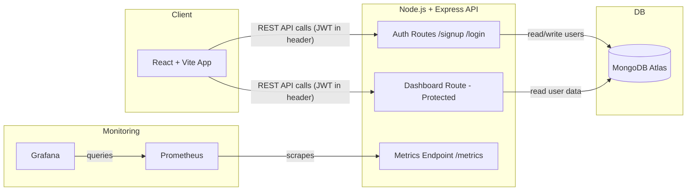
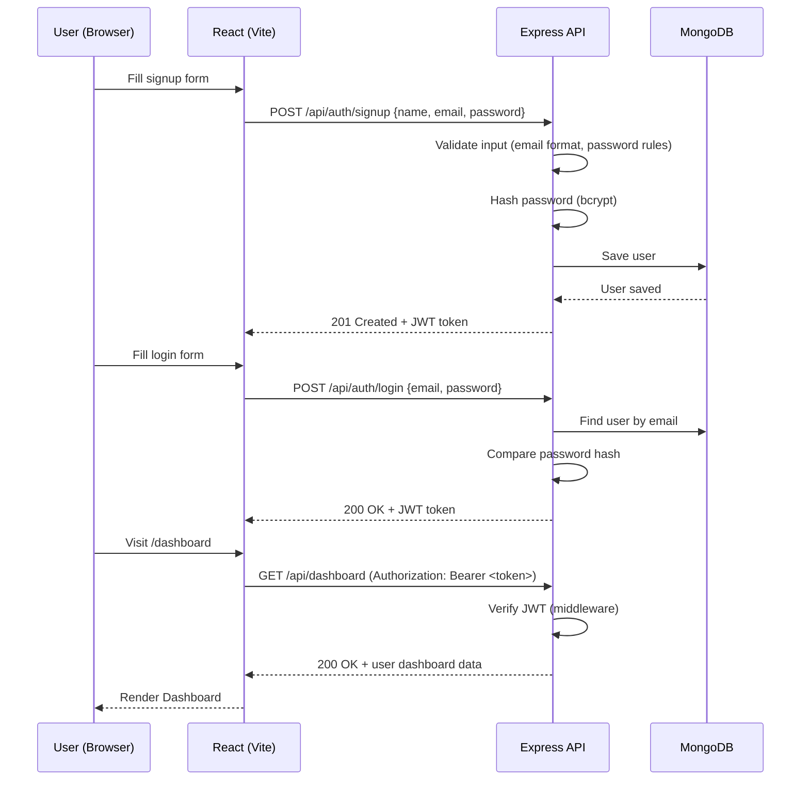
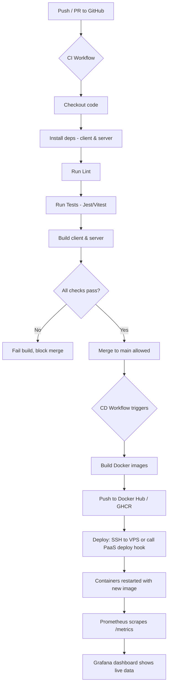

# MERN + DevOps Learning Project — Full Plan

> **Goal of this project:** The app itself is intentionally *small* (signup, login with password validation, and a protected dashboard). The real learning target is the **DevOps pipeline** around it — CI, Docker, CD, monitoring, and testing.

---

## 1. Tech Stack

| Layer | Technology |
|---|---|
| Frontend | React + Vite |
| Backend | Node.js + Express |
| Database | MongoDB (Atlas connection string) |
| Auth | JWT + bcrypt (password hashing) |
| Testing | Jest + Supertest (backend), Vitest (frontend) |
| Containerization | Docker + Docker Compose |
| CI | GitHub Actions |
| CD | GitHub Actions → Docker Hub / VPS (or Render/Railway) |
| Monitoring | Prometheus + Grafana |
| Reverse Proxy (optional but recommended) | Nginx |
| Logging (optional, later) | Winston + Loki/ELK |

---

## 2. High-Level Architecture



---

## 3. Request Flow (Signup / Login / Dashboard)



---

## 4. Project Folder Structure

```
devops-mern-project/
│
├── client/                      # React + Vite frontend
│   ├── src/
│   │   ├── pages/
│   │   │   ├── Signup.jsx
│   │   │   ├── Login.jsx
│   │   │   └── Dashboard.jsx
│   │   ├── api/axios.js
│   │   ├── App.jsx
│   │   └── main.jsx
│   ├── Dockerfile
│   ├── .env.example
│   └── package.json
│
├── server/                      # Node + Express backend
│   ├── src/
│   │   ├── routes/
│   │   │   ├── auth.routes.js
│   │   │   └── dashboard.routes.js
│   │   ├── controllers/
│   │   │   ├── auth.controller.js
│   │   │   └── dashboard.controller.js
│   │   ├── models/
│   │   │   └── User.js
│   │   ├── middleware/
│   │   │   ├── auth.middleware.js
│   │   │   └── validate.middleware.js
│   │   ├── metrics/
│   │   │   └── prometheus.js        # prom-client setup, /metrics route
│   │   ├── config/db.js
│   │   └── app.js
│   ├── tests/
│   │   ├── auth.test.js
│   │   └── dashboard.test.js
│   ├── Dockerfile
│   ├── .env.example
│   └── package.json
│
├── monitoring/
│   ├── prometheus.yml
│   └── grafana/
│       └── provisioning/          # datasource + dashboard json (optional)
│
├── nginx/                         # optional reverse proxy for prod
│   └── nginx.conf
│
├── docker-compose.yml             # local dev: client + server + mongo + prometheus + grafana
├── docker-compose.prod.yml        # prod-like compose (used in CD)
├── .github/
│   └── workflows/
│       ├── ci.yml                 # lint + test + build on every push/PR
│       └── cd.yml                 # build docker images + deploy on merge to main
└── README.md
```

---

## 5. App Scope (Keep It Minimal on Purpose)

**Backend routes:**
- `POST /api/auth/signup` — name, email, password (validate: email format, password ≥ 8 chars, at least 1 number + 1 special char)
- `POST /api/auth/login` — email + password → returns JWT
- `GET /api/dashboard` — protected route, requires valid JWT, returns basic user info
- `GET /metrics` — Prometheus scrape endpoint (via `prom-client`)
- `GET /health` — simple health check (used by Docker/CD to confirm the container is alive)

**Frontend pages:**
- Signup page (with client-side validation too, mirrors backend rules)
- Login page
- Dashboard page (protected route — redirect to login if no valid token in storage)

**Password validation rules (both frontend + backend):**
- Minimum 8 characters
- At least 1 uppercase, 1 lowercase, 1 number, 1 special character
- Hash with bcrypt (never store plain text)

This is deliberately small — resist the urge to add more features until the DevOps pipeline is working end-to-end.

---

## 6. Step-by-Step Roadmap (Learning Order)

### Phase 0 — App Setup (do this first, quickly)
1. Scaffold `client` with `npm create vite@latest`
2. Scaffold `server` with Express, connect to MongoDB Atlas via `MONGO_URI` env var
3. Build signup/login/dashboard as described above
4. Get it running locally with `npm run dev` on both sides — confirm it fully works before touching DevOps

### Phase 1 — Testing
1. Backend: Jest + Supertest — test signup validation, login success/failure, protected route rejecting bad tokens
2. Frontend: Vitest + React Testing Library — basic render + form validation tests
3. Add `npm test` scripts in both `package.json` files
4. **Why first:** CI is meaningless without tests to run

### Phase 2 — Dockerize
1. Write a `Dockerfile` for `server` (multi-stage: install deps → copy → run)
2. Write a `Dockerfile` for `client` (build step → serve static via Nginx or `vite preview`)
3. Write `docker-compose.yml` for local dev: `client`, `server`, `mongo` (or keep using Atlas and skip a mongo container), `prometheus`, `grafana`
4. Confirm `docker compose up` brings up the whole stack locally

### Phase 3 — CI with GitHub Actions
1. `.github/workflows/ci.yml` triggers on every push/PR to `main`
2. Steps: checkout → setup Node → install deps (client + server) → run lint → run tests → build (both client and server) → optionally build Docker images (no push yet)
3. Use a matrix or separate jobs for `client` and `server` so failures are isolated
4. Add a status badge to your README

### Phase 4 — CD (Deployment)
Pick **one** based on what you want to learn:
- **Simple/managed:** Push Docker images to Docker Hub → deploy to Render/Railway (least infra pain, good for a first pass)
- **More DevOps-y:** Push images to Docker Hub/GHCR → SSH into a cheap VPS (DigitalOcean/AWS EC2 free tier) → `docker compose pull && docker compose up -d` via GitHub Actions SSH step
- `.github/workflows/cd.yml` triggers on merge to `main`, runs after CI passes, builds + pushes images, then deploys

### Phase 5 — Monitoring (Prometheus + Grafana)
1. Add `prom-client` in Express, expose `/metrics` (track request count, response time, error rate)
2. Add `prometheus` service in `docker-compose.yml`, pointed at `server:5000/metrics` via `monitoring/prometheus.yml`
3. Add `grafana` service, connect it to Prometheus as a data source
4. Build 1-2 basic dashboards: request rate, latency, error rate
5. (Stretch) Add alerting rules in Prometheus (e.g., alert if error rate > 5%)

### Phase 6 — Polish / Things You're Missing (Suggested Additions)
- **Environment variable management:** `.env.example` files, never commit real `.env`, inject secrets via GitHub Actions Secrets in CI/CD
- **Logging:** Morgan for HTTP request logs, Winston for structured app logs
- **Rate limiting:** `express-rate-limit` on auth routes (protects against brute force — good real-world DevOps/security habit)
- **Reverse proxy:** Nginx in front of client+server in production, handles SSL (Let's Encrypt/Certbot) and routing
- **Secrets management:** GitHub Actions Secrets for `MONGO_URI`, `JWT_SECRET`, Docker Hub credentials
- **Container health checks:** `HEALTHCHECK` instruction in Dockerfiles hitting `/health`
- **Image tagging strategy:** tag Docker images with git SHA or semver, not just `latest`
- **(Stretch goal) Kubernetes:** once comfortable with Docker Compose, try converting to k8s manifests (Deployment, Service, Ingress) — natural next step after this project
- **(Stretch goal) Infrastructure as Code:** Terraform to provision the VPS/cloud resources instead of doing it manually

---

## 7. CI/CD Pipeline Flow



---

## 8. Suggested Order of README/Docs to Write As You Go

Keeping notes as you build each phase will help you retain the DevOps concepts:
1. `README.md` — how to run locally (both plain and via Docker Compose)
2. `docs/testing.md` — what's tested and why
3. `docs/ci-cd.md` — explain your pipeline decisions
4. `docs/monitoring.md` — what metrics you're tracking and why

---

## 9. Suggested Minimum Viable Order (If You Want the Shortest Path to "Full Pipeline Working")

1. App works locally (Phase 0)
2. Tests exist and pass locally (Phase 1)
3. Dockerized and `docker compose up` works (Phase 2)
4. CI runs lint+test+build on every push (Phase 3)
5. CD deploys on merge to main (Phase 4)
6. Prometheus + Grafana show live metrics from the deployed app (Phase 5)

Once all 6 are green, you have a genuinely complete beginner-to-intermediate DevOps pipeline — that's the real deliverable of this project, not the app's features.
